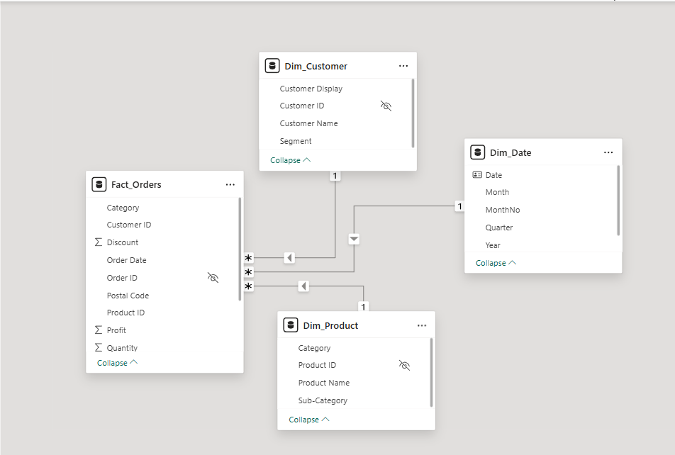

# Superstore_Performance_Dashboard (Power BI)
A Power BI report built on the **Superstore Orders** dataset to analyze sales performance over time, compare **CY vs PY**, and identify top customers/products.
Primary focus: **data transformation + star schema modeling + DAX measures**.

---

## 📄 Report Pages
This report contains **three dashboards (pages)**:

### 1) Overview Dashboard
High-level performance view with KPIs, YoY indicators, sales breakdown, CY vs PY trend, region/category matrix, and state sales.


**Key insights**
- Total Sales, Profit, Orders, Quantity (with YoY %)
- Sales Breakdown (Segment → Category → Sub-Category)
- Current Year vs Last Year (Sales by Month)
- Sales by Region & Category (heatmap matrix)
- Total Sales by State (Top states + map)
- 
---

### 2) Customer Dashboard
Customer-centric analytics focused on segmentation and top customer ranking.


**Key insights**
- Profit by Segment + segment profit cards
- Orders CY vs PY trend
- Customer ranking by Total Purchase with data bars
- Customer count KPI + customer search slicer

---

### 3) Product Dashboard
Product performance view focused on profitability by category, product ranking, and sub-category performance.


**Key insights**
- Total Profit by Category + category profit cards
- Product ranking by Sales
- Sub-Category Volume vs Profit (bubble scatter: Sales vs Profit sized by Quantity)
- Product count KPI + product search slicer

---


## 🧱 Data Model (Star Schema)
This project uses a **star schema** to keep the model clean, performant, and scalable.

**Fact table**
- 'Fact_Orders' (grain: one row per order line)

**Dimension tables**
- 'Dim_Date' (marked as Date table, to enable reliable time-intelligence calculations (e.g., YoY, CY vs PY) and consistent month/year sorting)
- 'Dim_Customer' (Customer Id, Customer Name, Segment, Customer Display that combines the Customer Name and Segment)
- 'Dim_Product' (Product Id, Product Name, Category, Sub-Category)
- 'Dim_Geo' (Region/State/City/Postal)
- 'Dim_ShipMode' (optional)

**Relationships**
- 'Dim_* (1) → Fact_Orders (*)' (One to Many Relationshop)
- Cross-filter direction: **Single**
- Active date relationship: 'Dim_Date[Date] → Fact_Orders[Order Date]'




---


## 🧹 Data Transformation (Power Query)
Key transformation steps performed in Power Query:

1. **Data type enforcement**
   - Dates: 'Order Date', 'Ship Date' → Date
   - Numeric: 'Sales', 'Profit', 'Discount' → Decimal
   - 'Quantity' → Whole number
   - IDs: 'Order ID', 'Customer ID', 'Product ID', 'Postal Code' → Text
   - Geography fields: Country, Region, State, City, Postal Code → Text (standardized for consistent joins)

2. **Text cleaning**
   - Trim/Clean is applied to fields like Customer Name and Location columns to avoid mismatched joins.

3. **Dimension creation**
   - Dimensions built using **Reference** from staging query:
     - Keep needed columns → Remove duplicates → load as Dim tables

4. **Staging queries**
   - Staging query ('Stg_Orders') used for transformations
   - **Enable Load disabled** for staging to keep the model clean

---

## 📐 Core DAX Measures
### Base KPIs
'''DAX
Total Sales = SUM ( Fact_Orders[Sales] )
Total Profit = SUM ( Fact_Orders[Profit] )
Total Orders = DISTINCTCOUNT ( Fact_Orders[Order ID] )
Total Quantity = SUM ( Fact_Orders[Quantity] )


**YoY (Sales / Profit)**
'''DAX
Sales LY =
CALCULATE ( [Total Sales], SAMEPERIODLASTYEAR ( Dim_Date[Date] ) )

Sales YoY % =
DIVIDE ( [Total Sales] - [Sales LY], [Sales LY] )

Profit LY =
CALCULATE ( [Total Profit], SAMEPERIODLASTYEAR ( Dim_Date[Date] ) )

Profit YoY % =
DIVIDE ( [Total Profit] - [Profit LY], [Profit LY] )

**Customer Ranking (Top customers by purchase)**
'''DAX
Total Purchase = [Total Sales]

Customer Rank =
RANKX(
    ALLSELECTED( Dim_Customer[Customer Name] ),
    [Total Purchase],
    ,
    DESC,
    Dense
)

Customer Count =
COUNTROWS( VALUES( Dim_Customer[Customer Name] ) )

**CY vs PY Orders trend***
'''DAX
Orders CY = [Total Orders]

Orders PY =
CALCULATE ( [Total Orders], SAMEPERIODLASTYEAR ( Dim_Date[Date] ) )

**CY vs PY Sales trend***
'''DAX
Sales CY = [Total Sales]

Sales PY =
CALCULATE(
    [Total Sales],
    SAMEPERIODLASTYEAR( dim_Date[Date] )
)

### Benchmark lines for Scatter (Sub-Category Volume vs Profit)
```DAX
Avg Sales (All Sub-Categories) =
AVERAGEX(
    ALL ( dim_Product[Sub-Category] ),
    [Total Sales]
)

Avg Profit (All Sub-Categories) =
AVERAGEX(
    ALL ( dim_Product[Sub-Category] ),
    [Total Profit]
)

---

📊 Report Features

- Year selector to filter all visuals

- KPI cards with sparklines (monthly trend inside KPI section)

- Donut chart: Total Profit by Segment

- Segment profit breakdown cards (Consumer / Corporate / Home Office)

- Line/area chart: Orders CY vs Orders PY by Month

- Customer ranking table with data bars, rank, and top-customer focus

- "No. of Customers" KPI to show filter context


---

▶️ How to use/run the report

1. Download the .pbix file from this repo: [add your file name here]
2. Open in Power BI Desktop
3. If needed, update the data source path (Transform Data → Data source settings)
4. Use the Year buttons and slicers to explore performance

---


🛠 Tools
1. Power BI Desktop
2. Power Query (ETL)
3. DAX (measures & time intelligence)

---
